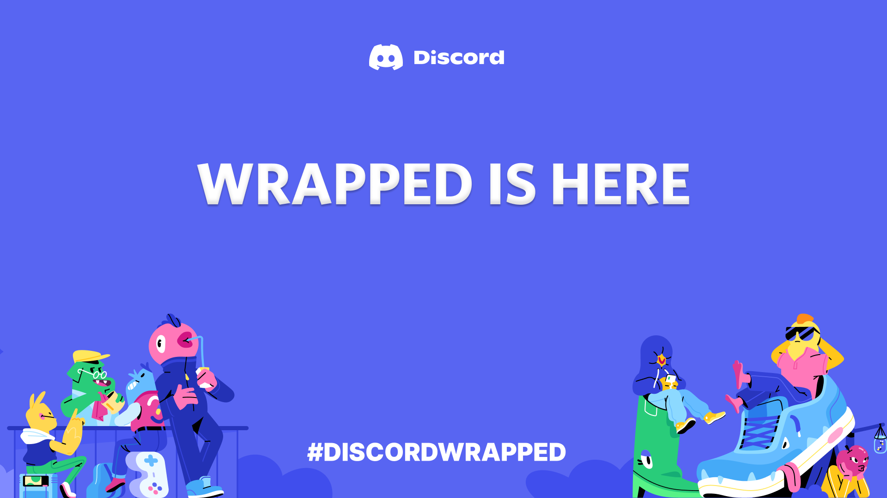

<p align="center">
  <a href="https://discordwrapped.com"></a>
</p>

<p align="center">
  An insight on all the data collected by Discord, formed into a video just like Spotify Wrapped!
</p>

# Try it out
You can try it out on [discordwrapped.com](https://discordwrapped.com).

# Credits
- [Face](https://github.com/face-hh) & [AssassiN](https://github.com/Assassin-1234) for starting the project
- [Iliannnn](https://github.com/Iliannnn) for cleaning up the code and creating the website
- [RedVortexDev](https://github.com/RedVortexDev) for redesign #1
- [Arnav](https://github.com/arnav-kr) for redesign #2
- [Zyztem](https://github.com/Zyztem) for dockerizing the project

# Self-hosting

## Prerequisites:
- Node.js and npm installed on your machine.

## Development

```bash
git clone https://github.com/Assassin-1234/discord-wrapped.git
cd discord-wrapped
cd frontend
npm install
npm run dev
cd ..
cd backend
npm install
npm run dev
```

Open your web browser and go to [localhost:5173](http://) or the URL specified in the frontend logs if the default port is already in use.

## Production

### Docker 🐳
```bash
git clone https://github.com/Assassin-1234/discord-wrapped.git
cd discord-wrapped
```

Edit `.env.example` in the backend directory to your preference.

```bash
docker-compose up -d
```

Using a reverse proxy, put the backend and frontend on the same address by adding a custom address `/api/` with the chosen backend port (3020 by default).

### Process Manager
```bash
cd frontend
npm install
npm run build
# Serve the build with your chosen process manager (e.g., http-server)
cd ..
cd backend
mv .env.example .env
npm install
npm run build
# Run with your chosen process manager
xvfb-run -s "-ac -screen 0 1920x1080x24" npm run start
```

Using a reverse proxy, put the backend and frontend on the same address by adding a custom address `/api/` with the chosen backend port (3020 by default).

# Contributing
Pull requests are appreciated
- Do not modify the `audio.mp3`
- Do not push your own data package

# License
This OSS project is under an Apache license.

# Contributors


